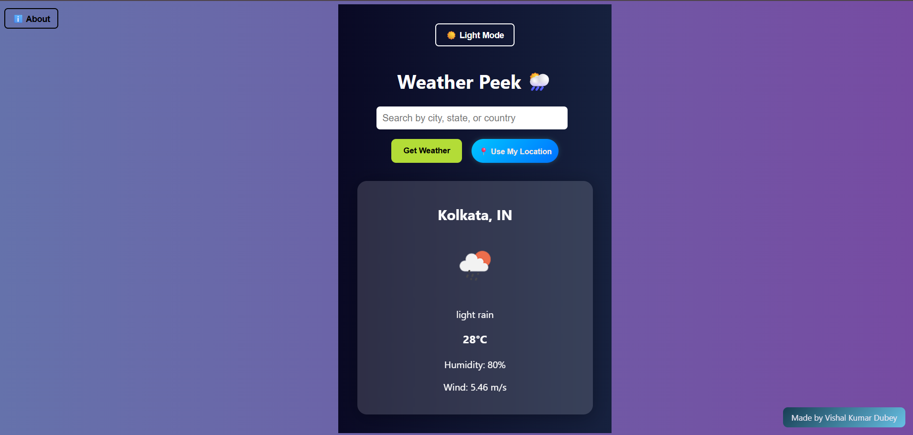
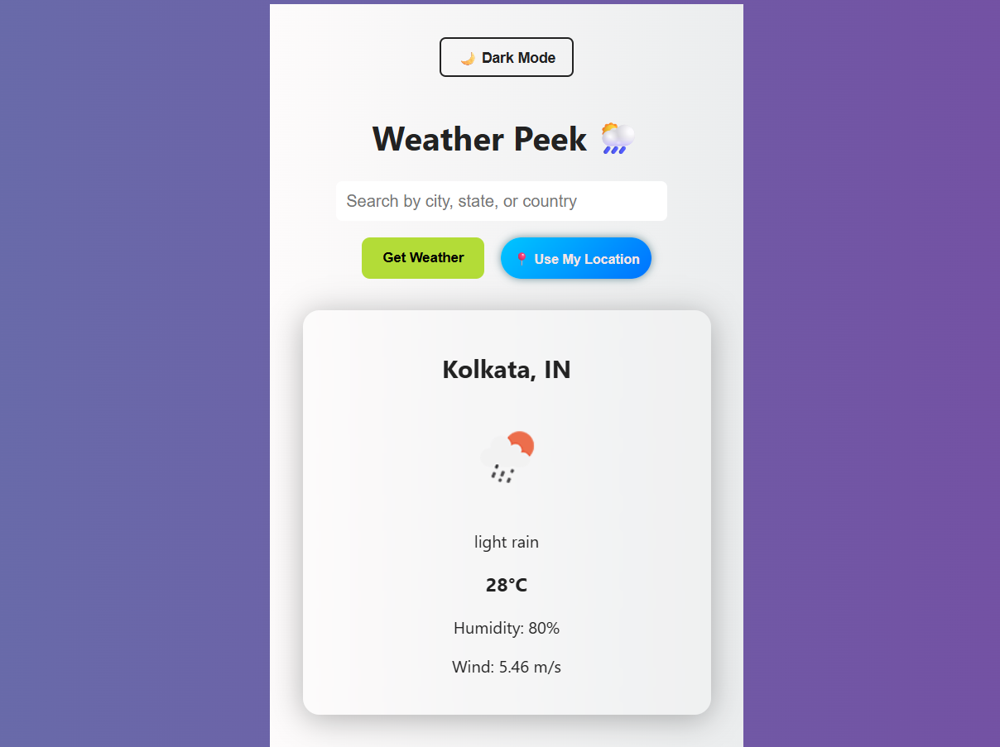
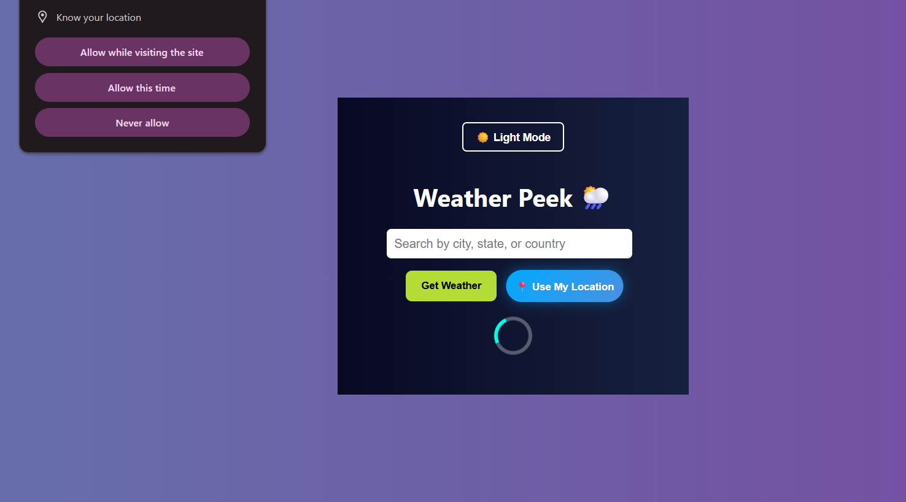

# 🌦️ WeatherPeek

**WeatherPeek** is a sleek, responsive React web application that lets users check live weather updates for any city, country, or region. It supports dynamic weather queries, regional forecasts, geolocation-based lookup, and includes a dark/light theme toggle — all built with care and style.

[🌐 Live Demo on Vercel](https://vercel.com/vishal-dubey01s-projects/weather-peek/C6w2nf9nfjE6VqbBjm3VbjkvDnc5)

---

## 📸 Screenshots

### 🏠 Homepage



### 🌙 Light Mode



### 📍 GeoLocation



---

## ✨ Features

- 🔍 **City/Region Search** – Fetch real-time weather data by city, country, or state.
- 📍 **Use My Location** – Get weather based on your device’s current geolocation.
- 🕶️ **Dark/Light Mode** – Toggle between themes with smooth styling.
- 🕘 **Recent Search History** – Revisit up to 5 recent locations.
- 🌐 **Fallback to Region Forecasts** – If city is unrecognized, top cities from the region are fetched.
- ⚙️ **Responsive & Clean UI** – Optimized for all screen sizes with a glassmorphic design touch.
- 🖼️ **Weather Icons** – Visual representation of weather using OpenWeatherMap icons.
- 📦 **Made with Create React App** – Ensures a smooth and scalable development setup.

---

## 🛠 Tech Stack

- ⚛️ **React.js** – Powered by Create React App
- 🎨 **CSS** – Glassmorphism, fully responsive styling
- 📡 **OpenWeatherMap API** – For real-time weather data
- 🌍 **Geolocation API** – To get user’s current location
- 🚀 **Vercel** – For fast and reliable hosting
- 🧠 **GeoService.js** – Custom logic to resolve regions into major cities

---

## 🧪 Local Setup

### 1. Clone the Repository

```bash
git clone https://github.com/Vishal-Dubey01/Weather-Peek.git
cd Weather-Peek
```

### 2. Install Dependencies

```bash
npm install
```

### 3. Add Your API Key

Create a `.env` file in the root directory:

```env
REACT_APP_WEATHER_API_KEY=your_openweathermap_api_key
```

> 🔐 Never commit your `.env` file to GitHub.

### 4. Start the App

```bash
npm start
```

Now visit [http://localhost:3000](http://localhost:3000) in your browser.

---

## 🚀 Deployment

The project is deployed using **Vercel**.

🔗 [Live Demo](https://vercel.com/vishal-dubey01s-projects/weather-peek/C6w2nf9nfjE6VqbBjm3VbjkvDnc5)

---

## 🙌 Author

**Made by Vishal Kumar Dubey** – with ❤️ and a lot of JavaScript.
